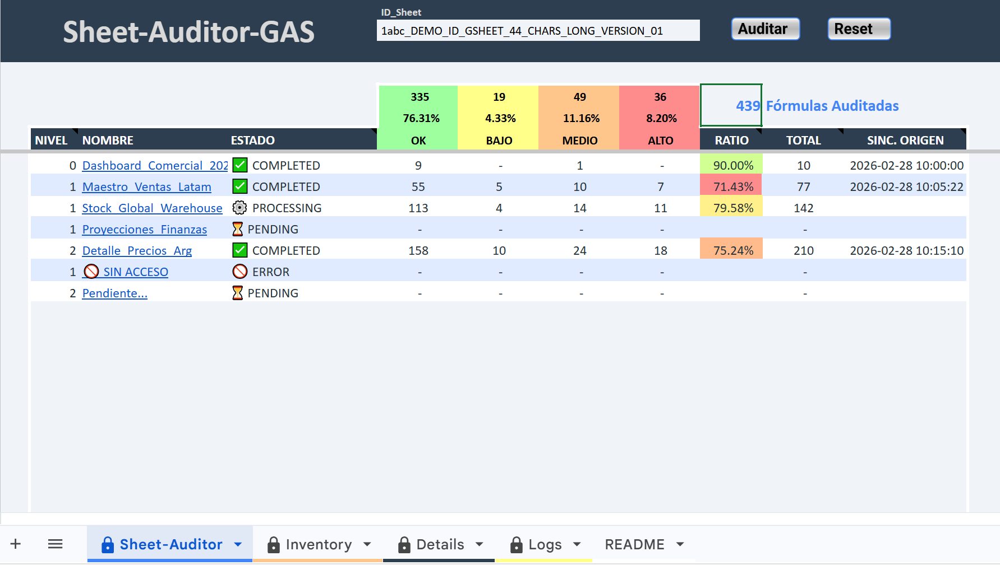
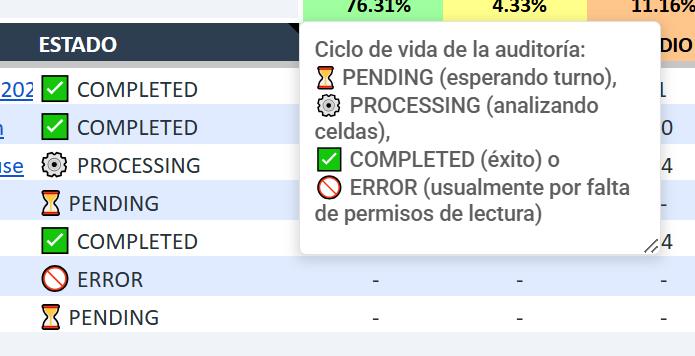
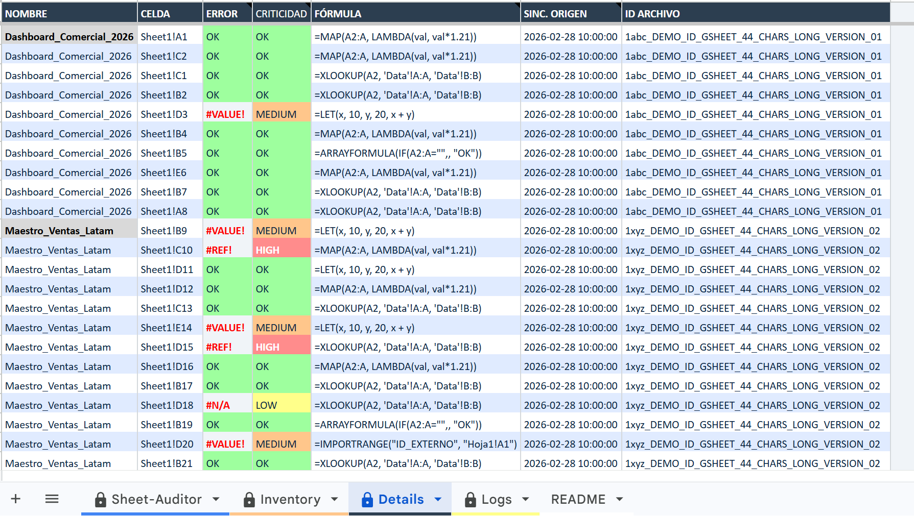
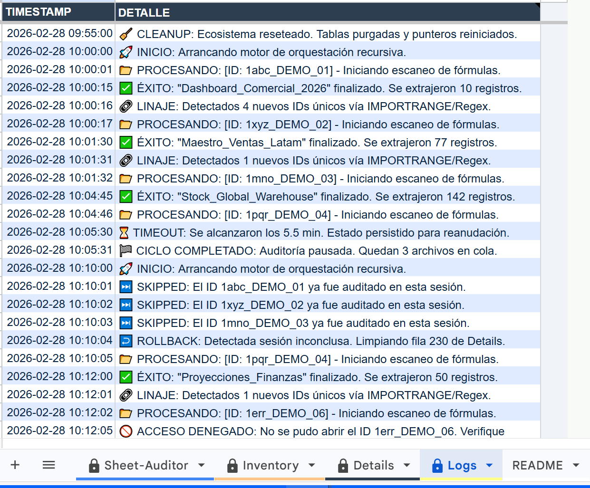

# 📊 Sheet-Auditor: Auditor de Google Sheets

### 📂 Organización de flujos de datos y tableros en Looker Studio

Esta herramienta ayuda a poner orden cuando tenés muchos archivos vinculados entre sí. Permite rastrear la red de conexiones y detectar fallas antes de que afecten tus reportes o tableros de **Google Looker Studio**.

---

## 💡 ¿Para qué sirve este proyecto?

Este auditor genera información estratégica para el día a día:

* **Lista de conexiones:** Identifica qué archivos dependen de otros (vía `IMPORTRANGE`), permitiendo ver en una tabla clara cómo fluye la información.
* **Dataset para IA:** Organiza las fórmulas de muchas hojas en una sola tabla. Esto es ideal para darle contexto a herramientas como **Gemini** o **ChatGPT** y que te ayuden a mejorar tu lógica.
* **Base para respaldos (Backups):** Al registrar las fórmulas complejas con su formato original, sirve como una base de consulta para recuperar lógica si alguien borra algo por error.
* **Detección de problemas en celdas:** Escanea cada hoja buscando links rotos, archivos sin acceso o errores de cálculo sin tener que entrar a cada planilla manualmente.

---

## 🚀 Cómo empezar

Para utilizar esta herramienta, seguí estos pasos:

1.  **Copia de la plantilla:** Realizá una copia de la plantilla oficial y sigue las instrucciones de configuración:  
    👉 [Hacer una copia del Template (Google Sheets)](https://docs.google.com/spreadsheets/d/1hUsSxZ1fknrzgNmQW-6tL8C3rhczVry0REE7jNg4NQg/copy)
2.  **Autorización:** Al ejecutar el script por primera vez, Google te pedirá permisos para gestionar tus archivos de Drive y Sheets.
3.  **Configuración:** Pegá el ID del archivo raíz que querés analizar en la celda **F2** del panel principal y presioná el botón de **"Auditar"**.

---

## 🛠️ Funciones principales

* **Escaneo recursivo:** Analiza las celdas de cada hoja buscando vínculos y sigue la cadena de archivos automáticamente.
* **Continuidad asegurada:** Si el proceso es muy largo y Google lo corta, el script retoma la tarea desde donde quedó sin duplicar datos.
* **Panel de control:** Un resumen visual con botones para auditar o resetear el sistema de forma sencilla.
* **Notas aclaratorias (Tooltips):** Se incluyen notas para facilitar el uso.

---

## 📸 Visualización (Capturas)

### Dashboard de Auditoría
Muestra el conteo de fórmulas analizadas y el estado de salud del ecosistema.
 

### Notas aclaratorias (Tooltips)
Información contextual integrada para facilitar la operación del sistema.
 

### Hoja de Detalles
La lista de todas las celdas auditadas con su lógica e indentación original.
 

### Bitácora técnica (Logs)
Registro de actividad del programa, avisando si hubo problemas de acceso o reanudación por tiempo.
 

---

## 🚀 Mejoras previstas

- [ ] **Visualización de conexiones:** Investigar la creación de esquemas de nodos y flechas (evaluando que no afecte el rendimiento del archivo).
- [ ] **Alertas automáticas:** Configurar disparadores (*triggers*) para que el sistema avise por mail si detecta errores críticos en archivos clave.
- [ ] **Buscador avanzado:** Filtros para encontrar términos específicos dentro de la tabla de fórmulas auditadas.

---

**Desarrollado por [Josue Cavalheiro Schipper](https://github.com/JosueCSchipper)**

📧 **Contacto:** [Josue.CavalheiroSchipper@gmail.com]
